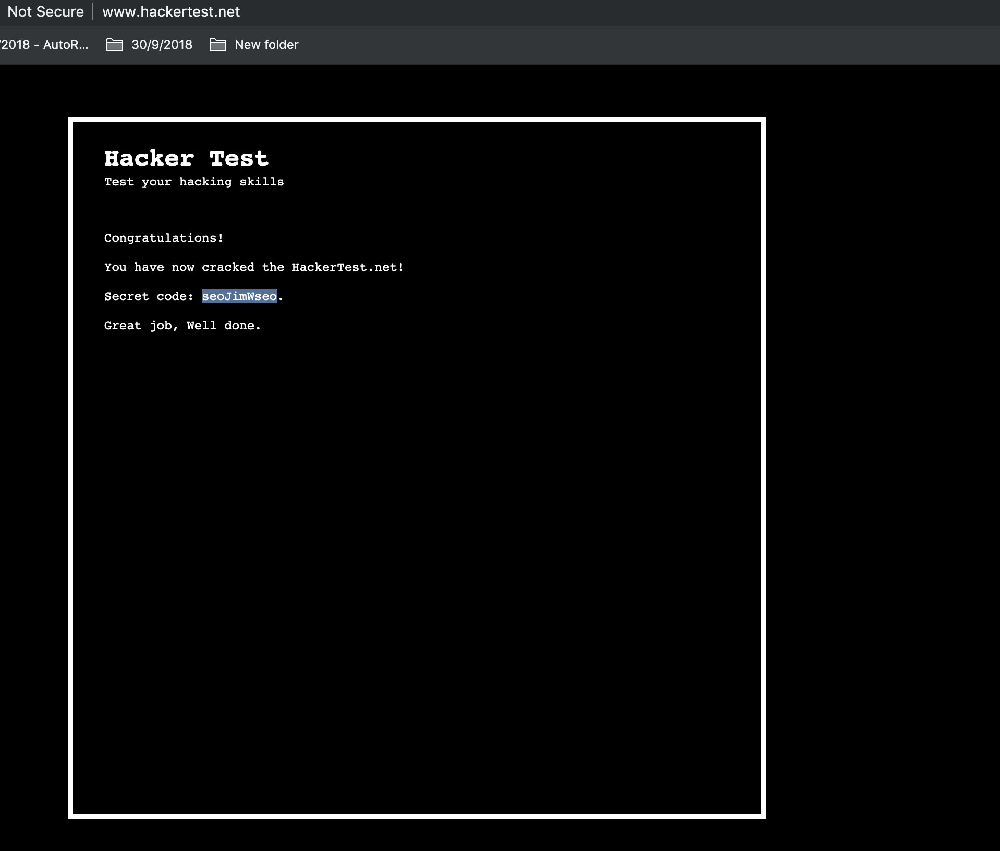

# My answers to hackertest.net Challenge 

## Screenshot



Hacker Test is an online "hacker simulator" where you can "test your hacking skills": [http://www.hackertest.net/](http://www.hackertest.net/).
This is yet another adventure into the world of "hacking challenges."
This challenge set was recommended to our Security Reading Group (SRG)/hckd group by Sergey Bratus of Dartmouth College.
What follows is a (hopefully brief) look at some thoughts on my experience working on these challenges.

> **Spoiler Alert:**
*I include the passwords for the various levels in plaintext below as well as information about the relevant observations to solve levels.
All of the passwords/hints are probably out there somewhere if you really just want those.
From a pedagogical stand point, it is of no value to simply copy the passwords.
Work through the challenges, understand the techniques, learn the tools and creative thinking skills.
If you aren't doing it for that reason, then why oh why even spend time on these challenges?!*

It is worth noting that in many of the challenges it is useful (necessary?) to look at the webpage source files.
Unless otherwise noted, I'm using Firefox and I can access the page source with the hot-key `cmd-U`.
Most popular browsers support some form of developer tools that may be useful to you - go check them out.
Furthermore, it is useful to have an application that allows you to manipulate images such as Photo Shop or GIMP.
To be honest,
    I didn't have either installed when I did the challenges so I relied on some friends to do the image-related stuff on their machines.

## Level 1
The direct link for this level is: [http://www.hackertest.net/](http://www.hackertest.net/).

Given that these challenges are supposed to help us improve our thinking around, e.g., HTML,
    start with the easiest thing we can do: examine the HTML source.
Search for the obvious stuff (e.g., "password").
Read the code.
What you'll hopefully notice is that, upon submitting a password attempt, the `check()` function is called;
    this function performs a comparison which either takes us to a new location or prompts us to try again.
Examining the code shows the expected password (the string "null") hard-coded in the page's HTML source.

## Level 2
The direct link for this level is: [http://www.hackertest.net/null.htm](http://www.hackertest.net/null.htm).

Again, we'll examine the HTML source.
There, in plain sight, is a password prompt and comparison of our entry to a the string "l3l".
That's the password.

**NOTE:** Don't make this harder than it has to be;
    l is a lowercase "L" not "1" - which is how I read it at first and couldn't figure out for a while why it wasn't working...
Take-away: to hack, one must be able to read... :D

## Level 3
The direct link for this level is: [http://www.hackertest.net/l3l.htm](http://www.hackertest.net/l3l.htm).

We are getting the hang of things now.
Examine the source.
Look for the obvious stuff.
Read and understand the code.

By reading the HTML we see reference to "alinkColor" (specifically, the line `pw=window.document.alinkColor;`).
You can go read about "alinkColor" (I did...) but you'll find that it's just a color setting, as one might have expected.
I tried the supposed default value.
I tried "black" and "red" and "blue."

If, however, you search on "alink" in the source (or just look a little above the relevant HTML), you'll see the text `alink="#000000"`.
This appears to be the expected password!
Enter that and you're off to level 4.

## Level 4 & 5
The direct link for this level is: [http://www.hackertest.net/abrae.htm](http://www.hackertest.net/abrae.htm).

This level kind of confused me because you arrive at the page and then it appears you are free to go on to the next level
    (without doing anything for *this* level).
I looked in the source and there doesn't appear to be anything tricky here.
Click the "Click here" link and it takes you to [http://www.hackertest.net/sdrawkcab.htm](http://www.hackertest.net/sdrawkcab.htm).

Now, we are taken to a new page that is awaiting yet another password input.
Take a peek at the source for *this* page.
Just after the password prompt we again see, right there as plain as the day is long, our password: "SAvE-as hELpS a lOt".
Correctly input the password and we'll be taken to the next level.

## Level 6
The direct link for this level is: [http://www.hackertest.net/save_as.htm](http://www.hackertest.net/save_as.htm).

In the source you'll find a link to an external javascript file, `passwd.js`.
Follow the link to the file and, once again, there you'll find the password for the next level in plaintext: "hackertestz".
Next level.

## Level 7
The direct link for this level is: [http://www.hackertest.net/included.htm](http://www.hackertest.net/included.htm).

Unlike many of the previous levels, there is nothing remarkable in the page's source, so I started looking into the unremarkable;
    follow links, examine style sheets, inspect site assets... ah ha!
Did you notice the background asset for the body of the page (`bg="images/included.gif"`)?
You can directly view the image here: http://www.hackertest.net/images/included.gif.
The credentials for the next level are in the bottom right corner of the image.

```
Username: phat
Password: jerkybar3
```

In retrospect, the `included.htm` name for this page should have been an immediate clue.
Hindsight is always 20/20 though, right?

## Level 8
The direct link for this level is: [http://www.hackertest.net/pwd2.php](http://www.hackertest.net/pwd2.php),
    though you'll have to go through the previous level and enter the credentials (otherwise it takes you to an "authentication failed" page).

In the source you'll find a link to a php script (`phat.php`).
Check out that script and you'll find an included background image (similar to the last level).
Go to [http://www.hackertest.net/images/phat.gif](http://www.hackertest.net/images/phat.gif).
In the lower righthand part of the image it reads: `Look for a .PhotoShopDocument!`

What is the extension for a Photo Shop document?
Search online if you don't know.
I'd recommend trying what your gut tells you to try - chances are, you'll be correct.

OK, great, visit [http://www.hackertest.net/images/phat.psd](http://www.hackertest.net/images/phat.psd).
You'll need to download and open the image in a program like GIMP where you can manipulate the layers....
If you strip off (i.e., hide) all the layers, then add them back one by one, you'll encounter a layer that has the login/password:
`zadmin / stebbins`

## Level 9
The direct link for this level is: [http://www.hackertest.net/phat.php](http://www.hackertest.net/phat.php).

Again, look at the source.
The page is very tall/wide - scroll around and you'll find the text "Password: Z2F6ZWJydWg= add a page extension to that".
If you try this directly, it won't work.
Why?
The password is base64 encoded so we must decode it:
```bash
$ echo "Z2F6ZWJydWg=" | base64 -D
gazebruh
```

Since the hint says "add a page extension" we can try to add a page extension to the decoded "word" (what kind of word is "gazebruh"?).

## Level 10
The direct link for this level is: [http://www.hackertest.net/gazebruh.php](http://www.hackertest.net/gazebruh.php).

Look at the italicized letters in the text on the page...
Combine the letters that are italicized to recover the password: `shackithalf`.

## Level 11
The direct link for this level is: [http://www.hackertest.net/rofl.php](http://www.hackertest.net/rofl.php).

In the source you'll find text that reads "go to clipart.php".
Are we going backwards in terms of difficulty here?

## Level 12
The direct link for this level is: [http://www.hackertest.net/clipart.php](http://www.hackertest.net/clipart.php).

Look closely at the image and you'll see the words "puta" and "php".
Inappropriate... but OK, we'll try that link in hopes that we will be taken to the next level
(and hopefully not alert our ISPs to our crudeness).

## Level 13
The direct link for this level is: [http://www.hackertest.net/puta.php](http://www.hackertest.net/puta.php).

Zoom in to look at the "Level 13" text.
On the "l" you'll see "4.xml".
This link will take us to the next level.

## Level 14
The direct link for this level is: [http://www.hackertest.net/4.xml](http://www.hackertest.net/4.xml).

Read the XML.
As with many of the previous challenges, you'll find a link.
Follow the link and you are onto the next level.

## Level 15
The direct link for this level is: [http://www.hackertest.net/4xml.php](http://www.hackertest.net/4xml.php).

The image shown on the page is a GIF (http://www.hackertest.net/images/bidvertiser.gif),
    but looking at it reveals that it is not animated.
What might happen if we animate it?

Do what you do to make GIFs.
I downloaded the file as an image and uploaded to, e.g., [http://gifmaker.me/](http://gifmaker.me/).
If you create a GIF and preview it - as the GIF is now animated, it will reveal the text "totally.php".

Now go to [http://www.hackertest.net/totally.php](http://www.hackertest.net/totally.php).
On this page there is a link to yet another image.
This time the image won't preview in the browser (nor will it preview locally if you download it) because it has been corrupted.
What can we do?

Well, pull down the image so you have it locally and use a hex editor to open the file.
Upon looking inside the file we can see a few strings that might be relevant.

```bash
$ xxd  pass2level16.jpg
00000000: ffd8 ffe0 2010 4a46 4946 2001 0220 2064  .... .JFIF ..  d
00000010: 2064 2020 ffec 2011 4475 636b 7920 0120   d  .. .Ducky .
00000020: 0420 2020 5020 20ff ee20 0e41 646f 6265  .   P  .. .Adobe
00000030: 2064 c020 2020 01ff db20 8420 0202 0202   d.   ... . ....
00000040: 0202 0202 0202 0302 0202 0304 0302 0203  ................
00000050: 0405 0404 0404 0405 0605 0505 0505 0506  ................
00000060: 0607 0708 0707 0609 090a 0a09 090c 0c0c  ................
00000070: 0c0c 0c0c 0c0c 0c0c 0c0c 0c0c 0103 0303  ................
00000080: 0504 0509 0606 090d 0b09 0b0d 0f0e 0e0e  ................
00000090: 0e0f 0f0c 0c0c 0c0c 4c65 7665 6c20 3136  ........Level 16
000000a0: 3a20 756e 6176 6169 6c61 626c 650f 0f0c  : unavailable...
000000b0: 0c0c 0c0c 0c0f 0c0c 0c0c 0c0c 0c0c 0c0c  ................
000000c0: 0c0c 0c0c 0c0c 0c0c 0c0c 0c0c 0c0c 0c0c  ................
000000d0: 0c0c ffc0 2011 0820 0f20 0f03 0111 2002  .... .. . .... .
000000e0: 1101 0311 01ff c420 4b20 0101 2020 2020  ....... K ..
000000f0: 2020 2020 2020 2020 2020 2009 0101 2020             ...
00000100: 2020 2020 2020 2020 2020 2020 2020 1001                ..
00000110: 2020 2020 2020 2020 2020 2020 2020 2020
00000120: 1101 2020 2020 2020 2020 2020 2020 2020  ..
00000130: 2020 ffda 200c 0301 2002 1103 1120 3f20    .. ... .... ?
00000140: bf80 2020 3fff d9                        ..  ?..
```

Alternatively you could just use `strings` which reveals the same strings but with a bunch of blank lines and less insight into the file.
Do whatever works best for you.
I tried subdirectories with these names and common file extensions.
Ultimately, using the word "unavailable" as the name for a subdirectory revealed a new page.

## Level 16
The direct link for this level is: [http://www.hackertest.net/unavailable/](http://www.hackertest.net/unavailable/).

At first glance you might think this page is a dead end.
Notice, however, that the page reads "UNAVAILABLE."
Look at the page source to see if there is anything going on behind the scenes.

Sure enough, there is a comment in the page source that points us towards an "image" subdirectory.
Go into [http://www.hackertest.net/unavailable/images/](http://www.hackertest.net/unavailable/images/).
And now we find an image file: `http://www.hackertest.net/unavailable/images/bg.jpg`.
Again, the file is corrupted so we'll need to download it and examine it.

To download the file I used `wget`:

```bash
$ wget http://www.hackertest.net/unavailable/images/bg.jpg
```

The file is quite large so start by using `xxd` to view the top 10 lines or so.

```bash
$ xxd bg.jpg | head
00000000: ffd8 ffe0 2010 4a46 4946 2001 0220 2064  .... .JFIF ..  d
00000010: 2064 2020 ffec 2011 4475 636b 792e 7068   d  .. .Ducky.ph
00000020: 7020 0120 0420 2020 5020 20ff ee20 0e41  p . .   P  .. .A
00000030: 646f 6265 2064 c020 2020 01ff db20 8420  dobe d.   ... .
00000040: 0202 0202 0202 0202 0202 0302 0202 0304  ................
00000050: 0302 0203 0405 0404 0404 0405 0605 0505  ................
00000060: 0505 0506 0620 2008 2020 0609 090d 0a0d  .....  .  ......
00000070: 0a09 090c 0c0c 0c0c 0c0c 0c0c 0c0c 0c0c  ................
00000080: 0c0c 0103 0303 0504 0509 0606 090d 0a0d  ................
00000090: 0a09 0d0a 0d0a 0f0e 0e0e 0e0f 0f0c 0c0c  ................
```

There is a PHP file noted here: `Ducky.php`.
You'll have to access the file to get to the next level.
Note, however, that you'll have to go up a directory level (i.e., `Ducky.php` lives in the `unavailable/` directory).

## Level 17
The direct link for this level is: [http://www.hackertest.net/unavailable/Ducky.php](http://www.hackertest.net/unavailable/Ducky.php).

Look in the source.
The hint is that the password is your IP address.

There are many ways to access your public facing IP address.
One way to to visit a website like [http://www.whatsmyip.org/](http://www.whatsmyip.org/).
Another way is to use the following command:

```bash
dig +short myip.opendns.com @resolver1.opendns.com
```

Enter your IP address in the password field and the page displays some new content that looks like some sort of error in the Ducky script.
This points us to the location/name of the file for the next level.
Go to it and you are off to level 18.

## Level 18
The direct link for this level is: [http://www.hackertest.net/level18.shtml](http://www.hackertest.net/level18.shtml).

The hint: "Think like a n00b."
I was *way too good* at this which must mean I'm still some sort of n00b.
Type "password" for the password.
This reveals the name of the file for the next level.

## Level 19
The direct link for this level is: [http://www.hackertest.net/level19.shtml](http://www.hackertest.net/level19.shtml).

Yet another GIF ([http://www.hackertest.net/images/level20_pass.gif](http://www.hackertest.net/images/level20_pass.gif))...
Download it and take a peek.
I could open it in Preview (I work on a Mac) and look at the "layers" in the GIF.
One of the layers revealed a "word" (again with this?!) which can be used to advance to the next level.
You'll have to try some file extensions that we have seen before...

## Level 20
The direct link for this level is: [http://www.hackertest.net/gazebruh2.htm](http://www.hackertest.net/gazebruh2.htm).

Lots of stuff going on here...

First, I looked at the page and then looked around in the source.
The source revealed a few comments and poorly hidden page text with (potentially?) relevant information.
Things like
```
^^^^^^^^^^ Change domain, add "22332" at the end, reach it and then get hold of ... ^^^^^^^^^^
```
and
```
<!--    Look above and right   //-->
```
and
```
<!-- ... the admin panel of it and then go from there or be lost forever -->
```

Also, since base64 is a common encoding, I tried to decode the string that was displayed in text on the page.
NOTE: I did *not* try to type out the hex from [http://www.hackertest.net/images/hex.gif](http://www.hackertest.net/images/hex.gif).

Try to decode the text string from the webpage did indeed reveal that it was base64 encoded multiple times.
At each step it was clear that the string was *still* in an encoded format because I could see the `=` symbol at the end
    which is usually a tell of base64 encoded data.
Performing the decode operation iteratively finally revealed a new link.

```bash
$ echo "VldwSk5Gb3lVa2hQUjJSclRUSlJlbFJITlU5TlIwNTBWbTE0YTFJelVqSlpNakF4WWtkT2NFNVlWbUZYUmtZeVYycEtTbG95U25SUFZFNU5Xbm93T1QwOT09" | base64 -D
VWpJNFoyUkhPR2RrTTJRelRHNU9NR050Vm14a1IzUjJZMjAxYkdOcE5YVmFXRkYyV2pKSloySnRPVE5NWnowOT09==
$ echo "VWpJNFoyUkhPR2RrTTJRelRHNU9NR050Vm14a1IzUjJZMjAxYkdOcE5YVmFXRkYyV2pKSloySnRPVE5NWnowOT09" | base64 -D
UjI4Z2RHOGdkM2QzTG5OMGNtVmxkR3R2Y201bGNpNXVaWFF2WjJJZ2JtOTNMZz09==
$ echo "UjI4Z2RHOGdkM2QzTG5OMGNtVmxkR3R2Y201bGNpNXVaWFF2WjJJZ2JtOTNMZz09" | base64 -D
R28gdG8gd3d3LnN0cmVldGtvcm5lci5uZXQvZ2Igbm93Lg==
$ echo "R28gdG8gd3d3LnN0cmVldGtvcm5lci5uZXQvZ2Igbm93Lg" | base64 -D
Go to www.streetkorner.net/gb now
```

Going to this link directly doesn't seem right.
At this point I leaned on the "hints" from the first step.

To expand, I changed the domain (from `streetkorner` to `hackertest`) and added `22332` to the end.
In the end it led me to this address: [http://www.hackertest.net/gb22332](http://www.hackertest.net/gb22332).

Now we see something about a "505 Not Found" error - same error when we "hit" [http://www.hackertest.net/gb22332/login.php](http://www.hackertest.net/gb22332/login.php),
even though we didn't try to go to a `login.php`.
This isn't nothing...

For whatever reason (because this game likes to play with file name and directory location trickery),
    let's now try: [http://www.hackertest.net/505/](http://www.hackertest.net/505/).
(I tried lots of combinations of subdirectories and filename extensions.
Feel free to try that too if you want the satisfaction of exhausting all other options...)

This also leads to a page with an error, but this time it is a "403 Not Found" error.
Maybe try the same sorts of stuff...
This took me to [http://www.hackertest.net/505/403/](http://www.hackertest.net/505/403/).

A page that reads "What is the answer to life, the universe, and everything?"
Google it or read The Hitchhiker's Guide to the Galaxy.
Either way, this gives you more things to try...
Also, looking at the page source reveals that you should: `<!-- Add a file extension to that -->`.

Great, let's try: [http://www.hackertest.net/42.php](http://www.hackertest.net/42.php).
This takes us to yet another page that simply reads: "Enter" (but the text is a link).
What?
This just takes us back to the home page for the HackerTest website.
Really?
Let's back up and look at the source of the last page ([http://www.hackertest.net/42.php](http://www.hackertest.net/42.php)).

Ah, OK, `<!-- Make sure you pass referrels -->`.
We can try that.
Maybe you can do this through your browser but I just used `wget` again:

```bash
wget --referer http://www.hackertest.net/42.php 'http://www.hackertest.net'
```

This saves a `index.html` file.
If we take a look at the file, it looks quite familiar, but at the very end there is a "congratulations" message:

```
<br><br>Congratulations!<br><br>You have now cracked the HackerTest.net!<br><br>Secret code: seoJimWseo.<br><br>Great job, Well done.
```

I'm not sure what to do with the secret code... so I'm done now... but if you know what to do with it, drop me a line!

**NOTE:**
Why did I know to look here?
My intuition here is to use programs like `head` and `tail` to look at the beginnings and ends of files.
While it isn't always the case, it is common to find juicy stuff in these locations.
There are of course other things you can do to examine files but this is a quick thing to do that can often reveal useful stuff).

## Level 21 (Wrapping up...)
No such level seems to exist right now so it looks like we are done.
Until next time...
